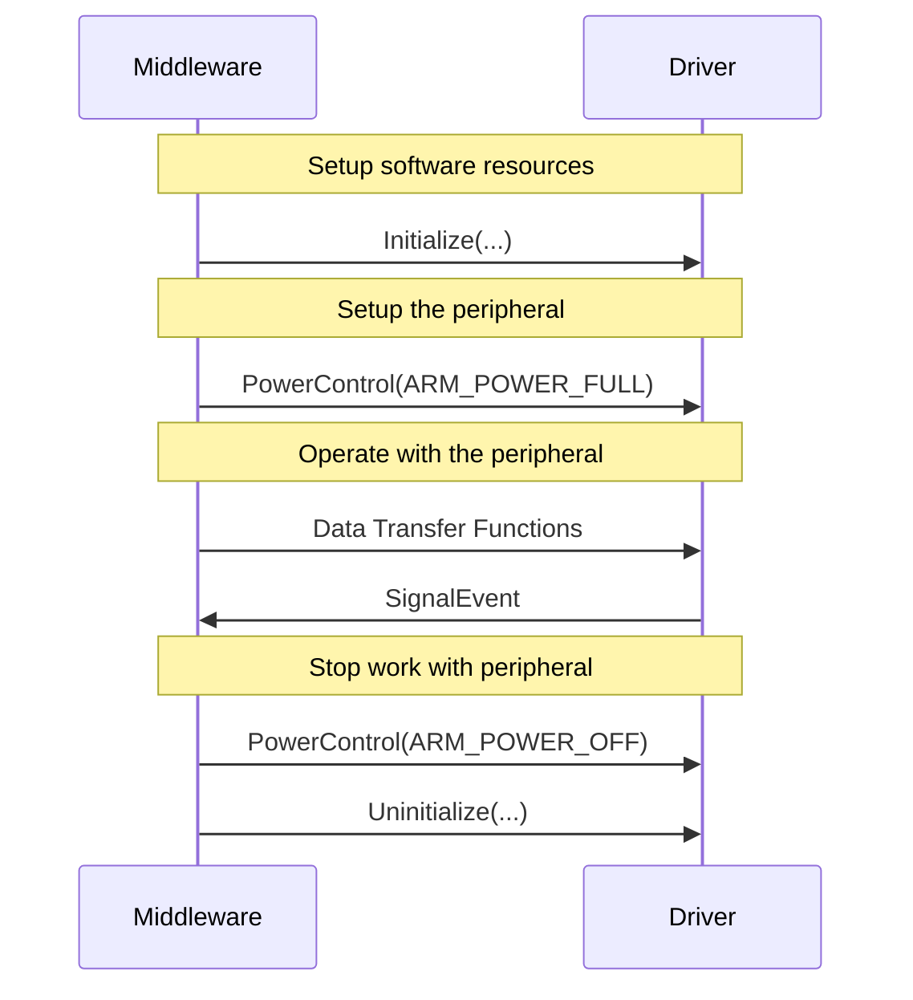
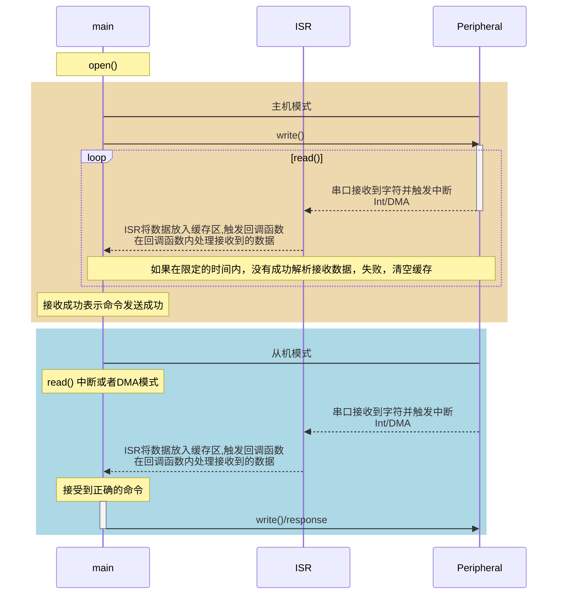

# 字符设备驱动方案比较

## 背景

目前我们公司ST芯片的驱动编写，都是基于ST官方软件STM32Cube生成的HAL库。

HAL库相对于以前的STD库来说，对象化程度更高，软件调用方便了很多。但是，相应的代码也变的很臃肿，相同功能的代码，HAL库编写生成的Bin文件为48KB，用STD库编写生成的Bin文件为23K。

HAL库的执行效率也比STD库慢。

并且，由于HAL库的复杂性，导致其库的==稳定性==相对简单的STD库更差。

我们公司还拥有Cypress的芯片平台。

为了将来能将两套芯片平台通用化，并且可以优化由HAL库构成的代码，现阶段我们需要一套外设驱动，用来驱动各种外设(UART，I2C，SPI...)

## 方案

+ ==FreeRTOS+IO== (**个人倾向方案**)
+ CMSIS Driver 
+ RT_thread的接口 

## 考虑点

1. 有操作系统 VS 无操作系统
2. 并发控制
3. 易于使用
4. 分别考虑作为**Master**和**Slave**的情况
5. 移植性

## 各方案特点

| 设备驱动       | FreeRTOS+IO                   | CMSIS Driver                         | RT_Thread Driver |
| -------------- | ----------------------------- | ------------------------------------ | ---------------- |
| 并发控制       | ×(自己使用FreeRTOS信号量封装) | ×(自主开发)                          | ✔                |
| 无操作系统环境 | ×(修改库文件)                 | ✔                                    | ×(修改库文件)    |
| 扩展性         | 好                            | 好                                   | 好               |
| 学习成本       | 低                            | 一般                                 | 高               |
| 移植性         | 好                            | 一般                                 | 差(没有文档)     |
| Demo Code      | Demo Code                     | 能用Keil生成相关芯片可执行代码作参考 | Demo Code        |

## FreeRTOS+IO

### 特点

+ 类Linux/POSIX接口
+ 分层明显，支持不同的芯片简单
+ 自身支持阻塞式以及非阻塞式可选
+ 和FreeRTOS天然绑定，如果需要移植到无操作系统的程序中，需要进行兼容性改动

### Available_Peripherals

> 定义芯片支持的外设

```C
typedef struct xAVAILABLE_DEVICES
{
    /* Text name of the peripheral.  For example, “/UART0/”, or “/SPI2/”. */
    const int8_t * const pcPath;				
	
    /* The type of the peripheral, as defined by the Peripheral_Types_t enum. */
    const Peripheral_Types_t xPeripheralType;	
	
    /* The base address of the peripheral in the microcontroller memory map. */
    const void *pvBaseAddress;
} Available_Peripherals_t;
```

### Peripheral_Descriptor/Peripheral_Control

> Peripheral_Descriptor_t是void *类型重定义，最终指向Peripheral_Control_t结构体

```c
/* Structure containing control information for an open peripheral. */
typedef struct xPERIPHREAL_CONTROL
{
	Peripheral_write_Function_t write;			/* The function used to write to the peripheral. */
	Peripheral_read_Function_t read;			/* The function used to read from the peripheral. */
	Peripheral_ioctl_Function_t ioctl;			/* The function used for ioctl access to the peripheral. */
	Transfer_Control_t *pxTxControl;			/* Pointer to the transfer control structure used to manage transmissions through the peripheral. */
	Transfer_Control_t *pxRxControl;			/* Pointer to the transfer control structure used to manage receptions from the peripheral. */
	const Available_Peripherals_t *pxDevice;	/* Pointer to the structure that defines the name and base address of the open peripheral. */
	int8_t cPeripheralNumber;					/* Where more than one peripheral of the same kind is available, this holds the number of the peripheral this structure is used to control. */
} Peripheral_Control_t;
```

### API_Reference

#### [FreeRTOS_open](https://www.freertos.org/FreeRTOS-Plus/FreeRTOS_Plus_IO/FreeRTOS_open.html)

```c
/**
 * @description: 打开某个外设来使用Freertos+IO
 * @param pcPath:  外设名称字符串
 		  ulFlags: 模式标志位，当前未使用，预留接口
 * @return: 如果外设未能打开，返回NULL。否则范围Peripheral_Descriptor_t类型变量，
 			供FreeRTOS_read(), FreeRTOS_write()和FreeRTOS_ioctl()接口使用
 */
Peripheral_Descriptor_t FreeRTOS_open( const int8_t *pcPath, const uint32_t ulFlags );
```

#### [FreeRTOS_read](https://www.freertos.org/FreeRTOS-Plus/FreeRTOS_Plus_IO/FreeRTOS_read.html)

```C
/**
 * @description: 读取一个或多个字节从已打开的外设
 * @param pxPeripheral: The descriptor associated with the peripheral from which bytes 							are being read.
 		  pvBuffer: 	存放读取数据的缓存区域
 		  xBytes: 		读取的字节数
 * @return: 实际读取到的字节数
 */
size_t FreeRTOS_read( Peripheral_Descriptor_t const pxPeripheral, 
                      void * const pvBuffer, 
                      const size_t xBytes );
```

> FreeRTOS_ioctl() is used to set the read timeout value.
>
> 如果采用Poll传输模式，使用FreeRTOS_read()的任务在等待要求读取的字节数前不会进入阻塞状态。
>
> 如果采用Interrupt传输模式，使用FreeRTOS_read()的任务

#### [FreeRTOS_write](https://www.freertos.org/FreeRTOS-Plus/FreeRTOS_Plus_IO/FreeRTOS_write.html)

```C
/**
 * @description: 写入一个或多个字节到已打开的外设
 * @param pxPeripheral: The descriptor associated with the peripheral from which bytes 							are being read.
 		  pvBuffer: 	存放待写入数据的缓存区域
 		  xBytes: 		写入的字节数
 * @return: 实际写入的字节数。
 */
size_t FreeRTOS_write( Peripheral_Descriptor_t const pxPeripheral, 
                       const void *pvBuffer, 
                       const size_t xBytes );
```

> FreeRTOS_ioctl()is used to set the write timeout value.

#### [FreeRTOS_ioctl](https://www.freertos.org/FreeRTOS-Plus/FreeRTOS_Plus_IO/FreeRTOS_ioctl.html)

```c
/**
 * @description: input output device control
 * @param pxPeripheral: The descriptor associated with the peripheral from which bytes 							are being read.
 		  ulRequest:    请求码
 		  pvValue:      所使用的请求码的特定参数
 * @return: 成功返回pdPASS，失败返回pdFAIL
 */
BaseType_t FreeRTOS_ioctl( Peripheral_Descriptor_t const xPeripheral, 
                              uint32_t ulRequest, 
                              void *pvValue );
```


#### data transfer modes

| Transfer Mode                     | Data Direction | Description                                                  |
| --------------------------------- | -------------- | ------------------------------------------------------------ |
| Polled                            | Read and write | The most basic read and write mode, where busy waits are used instead of interrupts. |
| Interrupt driven circular buffer  | Read only      | An interrupt driven mode where received data is placed into a buffer by an interrupt service routine, reads then remove data from the buffer. |
| Interrupt driven zero copy        | Write only     | An efficient mode where an interrupt service routine transmits data directly from a write buffer, with not additional RAM required for intermediary storage, and no additional copy required. |
| Interrupt drivern character queue | Read and write | A simple mode where FreeRTOS queues are used to buffer data between an interrupt service routine and the read or write operation. |

### 移植要点

#### 文件结构

> 已I2C为例

```C
FreeRTOS+IO:
├─Common 
│      FreeRTOS_DriverInterface.c         //FreeRTOS+IO API，FreeRTOS_open()本身不具备与驱动能力，寻找对应的驱动流程
│      FreeRTOS_IOUtils.c
│      IOUtils_CharQueueTxAndRx.c         //在不同传输方式的情况下，对内存进行相应处理
│      IOUtils_CircularBufferRx.c
│      IOUtils_ZeroCopyTx.c
│
├─Device//存放不同芯片驱动库，添加不同的芯片主要修改这个文件夹下的内容
│  └─STM32H743				
│      │  FreeRTOS_STM32H743_DriverInterface.c   
│      │  FreeRTOS_STM32H743_i2c.c               //与STM32H743的I2C外设相关的底层驱动
│      │
│      └─SupportedBoards
│              STM32H743_base_board.h     //STM32H743上外设资源定义
│
└─Include//库文件
        FreeRTOSIOConfig.h
        FreeRTOS_DriverInterface.h//内置一些ioctl的请求码，如果有自定义的通用请求码，可以在此添加
        FreeRTOS_i2c.h//根据官方的命名标准定义不同种类的外设Callback函数，只被FreeRTOS_Open(), FreeRTOS_write(), FreeRTOS_read() and FreeRTOS_ioctl() 调用
        FreeRTOS_IO.h //文件内include了你需要用使用的xxxxxx_base_board.h文件
        FreeRTOS_IO_BSP.h
        IOUtils_CharQueueTxAndRx.h
        IOUtils_CircularBufferRx.h
        IOUtils_Common.h
        IOUtils_ZeroCopyTx.h

```

+ 对于不同芯片的支持，修改或添加Device文件夹下的内容
+ 如果内置的请求码不能满足使用需求，可以在FreeRTOS_DriverInterface.h文件中添加

## CMSIS Driver

### 特点

+ 跟操作系统无关
+ 自身仅支持非阻塞式的操作
+ 驱动中断层转为事件驱动
+ 被集成到Keil5中，可以由Keil5直接生成(开发简便)
+ 封装程度不高，跟ST的==HAL库==类似

### Function Call Sequence




### API_Reference（以串口为例）

```C
/**
\brief Access structure of the I2C Driver.
*/
typedef struct _ARM_DRIVER_I2C {
  ARM_DRIVER_VERSION   (*GetVersion)     (void);                                                                ///< Pointer to \ref ARM_I2C_GetVersion : Get driver version.
  ARM_I2C_CAPABILITIES (*GetCapabilities)(void);                                                                ///< Pointer to \ref ARM_I2C_GetCapabilities : Get driver capabilities.
  int32_t              (*Initialize)     (ARM_I2C_SignalEvent_t cb_event);                                      ///< Pointer to \ref ARM_I2C_Initialize : Initialize I2C Interface.
  int32_t              (*Uninitialize)   (void);                                                                ///< Pointer to \ref ARM_I2C_Uninitialize : De-initialize I2C Interface.
  int32_t              (*PowerControl)   (ARM_POWER_STATE state);                                               ///< Pointer to \ref ARM_I2C_PowerControl : Control I2C Interface Power.
  int32_t              (*MasterTransmit) (uint32_t addr, const uint8_t *data, uint32_t num, bool xfer_pending); ///< Pointer to \ref ARM_I2C_MasterTransmit : Start transmitting data as I2C Master.
  int32_t              (*MasterReceive)  (uint32_t addr,       uint8_t *data, uint32_t num, bool xfer_pending); ///< Pointer to \ref ARM_I2C_MasterReceive : Start receiving data as I2C Master.
  int32_t              (*SlaveTransmit)  (               const uint8_t *data, uint32_t num);                    ///< Pointer to \ref ARM_I2C_SlaveTransmit : Start transmitting data as I2C Slave.
  int32_t              (*SlaveReceive)   (                     uint8_t *data, uint32_t num);                    ///< Pointer to \ref ARM_I2C_SlaveReceive : Start receiving data as I2C Slave.
  int32_t              (*GetDataCount)   (void);                                                                ///< Pointer to \ref ARM_I2C_GetDataCount : Get transferred data count.
  int32_t              (*Control)        (uint32_t control, uint32_t arg);                                      ///< Pointer to \ref ARM_I2C_Control : Control I2C Interface.
  ARM_I2C_STATUS       (*GetStatus)      (void);                                                                ///< Pointer to \ref ARM_I2C_GetStatus : Get I2C status.
} const ARM_DRIVER_I2C;
```

### 移植要点

#### 文件结构

```C
├─DriverTemplates 
│      Driver_I2C.c   //源文件是相应的空函数定义，需要自己实现全部相关函数
│
├─Include
│      Driver_I2C.h   //头文件中定义了相关接口，以及部分常用的Flg、Event
```

## RT_Thread相关驱动

### 特点
+ Linux/POSIX接口
+ 跟**RT_Thread操作系统关系密切**

### 设备定义相关结构体

```C
/**
 * Device structure
 */
struct rt_device
{
    struct rt_object          parent;                   /**< inherit from rt_object */

    enum rt_device_class_type type;                     /**< device type */
    rt_uint16_t               flag;                     /**< device flag */
    rt_uint16_t               open_flag;                /**< device open flag */

    rt_uint8_t                ref_count;                /**< reference count */
    rt_uint8_t                device_id;                /**< 0 - 255 */

    /* device call back */
    rt_err_t (*rx_indicate)(rt_device_t dev, rt_size_t size);
    rt_err_t (*tx_complete)(rt_device_t dev, void *buffer);

#ifdef RT_USING_DEVICE_OPS
    const struct rt_device_ops *ops;
#else
    /* common device interface */
    rt_err_t  (*init)   (rt_device_t dev);
    rt_err_t  (*open)   (rt_device_t dev, rt_uint16_t oflag);
    rt_err_t  (*close)  (rt_device_t dev);
    rt_size_t (*read)   (rt_device_t dev, rt_off_t pos, void *buffer, rt_size_t size);
    rt_size_t (*write)  (rt_device_t dev, rt_off_t pos, const void *buffer, rt_size_t size);
    rt_err_t  (*control)(rt_device_t dev, int cmd, void *args);
#endif

#if defined(RT_USING_POSIX)
    const struct dfs_file_ops *fops;
    struct rt_wqueue wait_queue;
#endif

    void                     *user_data;                /**< device private data */
};
```

### [API_Reference(以I2C为例)](https://www.rt-thread.org/document/site/programming-manual/device/uart/uart/)
函数|描述
---|---
rt_device_t rt_device_find(const char* name);|根据 I2C 总线设备名称查找设备获取设备句柄
rt_size_t rt_i2c_transfer(struct rt_i2c_bus_device *bus, struct rt_i2c_msg msgs[], rt_uint32_t num);	|打开设备

### I2C消息结构体

> 和Linux中实现方法相同，降低学习成本

```C
struct rt_i2c_msg
{
    rt_uint16_t addr;    /* 从机地址 */
    rt_uint16_t flags;   /* 读、写标志等 */
    rt_uint16_t len;     /* 读写数据字节数 */
    rt_uint8_t  *buf;    /* 读写数据缓冲区指针　*/
}
```

## I2C ==ReStart==模式实现

### FreeRTOS+IO

定义**I2C_RDRW_IOCTL**的ioctl请求码，以及基于struct i2c_msg的struct i2c_rdwr_ioctl_data结构体。

```C
/*伪代码*/
struct i2c_rdwr_ioctl_data work_queue;
work_queue.msgs[0].len = 1;
work_queue.msgs[0].addr = xxx;
work_queue.msgs[0].buf = xxx;

work_queue.msgs[1].len = 1;
work_queue.msgs[1].flags = I2C_M_RD;//接收
work_queue.msgs[1].addr = xxx;
work_queue.msgs[1].buf = xxx;

ret = ioctl(&i2c, I2C_RDWR, &work_queue);
...
```

### CMSIS Driver

~~~C
/*伪代码*/
MasterTransmit(slave_addr, pdata, len, NO_STOP);
ret = wait_transfer_done_single(100ms);
if(ret != OK)
    goto __ERR;
MasterReceive(slave_addr, pdata, len, STOP);
ret = wait_transfer_done_single(100ms);
if(ret != OK)
    goto __ERR;
return OK;
__ERR:
	return ERROR;
~~~

## 总结

FreeRTOS+IO的结构比较标准，针对不同的字符串设备，接口是完全一样的 。将来扩展SPI，UART等设备驱动时，接口不变。

CMSIS Driver的Demo和ST自身的HAL库基本相同

RT_Thread Driver看了驱动定义的结构体，是以Linux的设备驱动为原型，进行了增减，对于没接触过Linux设备驱动的工程师，学习成本比较高。相反，如果是熟悉Linxu设备驱动的工程师，上手也快。缺点是和RT_Thread OS集成度较高，将Driver部分从中分离出来费事。


## 串口主从机实现

### OS

> 初始化两个信号量:
>
> 1. Recv_Single: ISR接收到数据的通知信号量
> 2. validCmd_Single: 传递成功接收数据的信号量
>
> write()前重置两种信号量

~~~mermaid
sequenceDiagram
participant mthread
participant remote_thread
participant ISR
participant Peripheral
Note over mthread: open()
Note left of mthread: 初始化信号量
loop  等待信号量
Note over remote_thread: 从机数据处理线程
end

rect rgb(238, 216, 174)
mthread->Peripheral: 主机模式
mthread ->>Peripheral: write()
activate Peripheral
loop read()
Peripheral->>ISR:串口接收到字符并触发中断 <br/> Int/DMA 
deactivate Peripheral
ISR->>remote_thread: ISR将数据放入缓存区<br/>Recv_Single
Note over remote_thread: 处理数据 
Note over mthread,Peripheral: 在限定的时间内，没有获取到validCmd_Single，则命令发送失败
end
remote_thread->>mthread: 从机数据处理线程接收到正确指令<br/>validCmd_Single
end

rect rgb(173, 216, 230)
mthread->Peripheral: 从机模式
Note over mthread: read() 中断或者DMA模式
Peripheral->>ISR:串口接收到字符并触发中断 <br/> Int/DMA 
ISR->>remote_thread: ISR将数据放入缓存区<br/>Recv_Single
Note over remote_thread: 从机数据处理线程激活<br/>解析指令
Note over remote_thread: 接收到正确的指令
activate remote_thread
remote_thread->>Peripheral: write()/response
deactivate remote_thread
end


~~~


### NO OS

